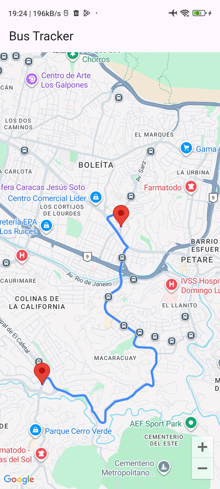
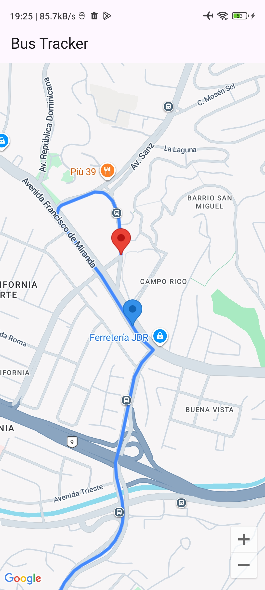
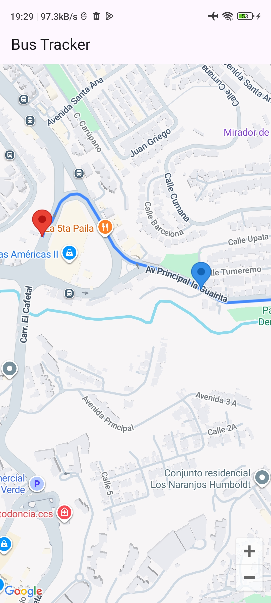

# Bus Tracker – Student App

The goal of this project is to create a short app that allows students to see where the university bus is on its route. This covers only a small portion of the backend and does not include authentication.

## ✅ Features
- Open Map
- Show route
- Show tracking bus

## ⚙️ Tech Stack
- flutter 3.7
- flutter_bloc 9.1
- flutter_dotenv 6.0
- dio 5.10
- retrofit 4.6
- google_maps_flutter 2.14
- pusher_client_socket 0.0.5


## 💾 Installation

Install and run

1. Clone and move to folder
```bash
$ git clone git@github.com:abrahamuchos/bus_tracker_student_app.git
$ cd bus_tracker_student_app
```

2. Install dependencies
```bash
$  flutter pub get
```

3. Config your Google Maps API key (_android/app/src/main/AndroidManifest.xml_)

```xml
<meta-data android:name="com.google.android.geo.API_KEY" android:value="YOUR_API_HERE"/>
```
_Remember to add key restrictions for the API key using the fingerprint._
```bash
$ keytool -list -v -keystore ~/.android/debug.keystore -alias androiddebugkey -storepass android -keypass android
```

5. Config `.env` variables. Check `.env.example` to create file.

4. Run dev `flutter run`

If you encounter issues, run `flutter doctor` to check for missing dependencies or configuration errors.

## 📦 Environment Variables

To run this project, you will need to add the following environment variables to your .env file

```dotenv
API_BASE_URL=

REVERB_HOST=
REVERB_PORT=
REVERB_APP_KEY=
```


## 📄 Docs


## 📷 Screenshot





## 🧑‍💻 Authors
- [Portfolio - Abrahamuchos](https://abrahamuchos.onrender.com/)
- [@abrahamuchos](https://github.com/abrahamuchos)
- [Contact mail](mailto:abrahmuchos@gmail.com)

